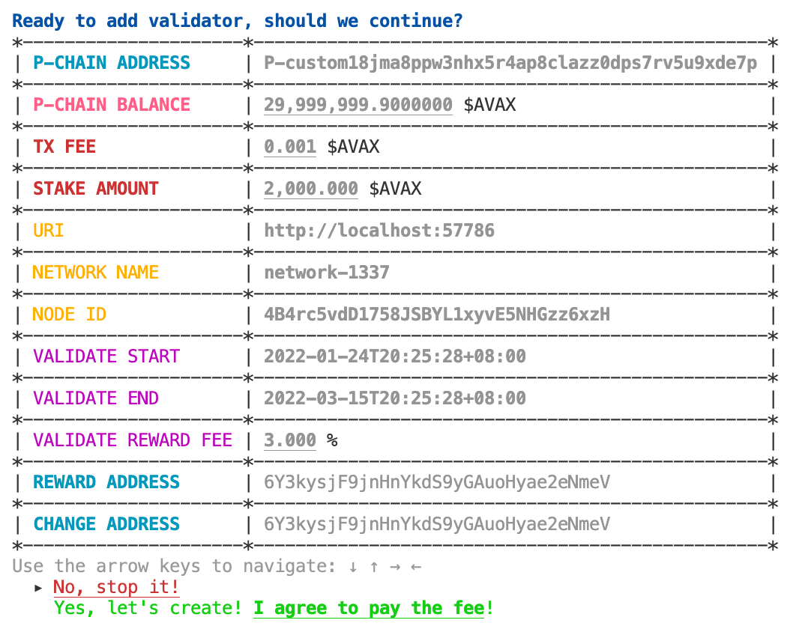
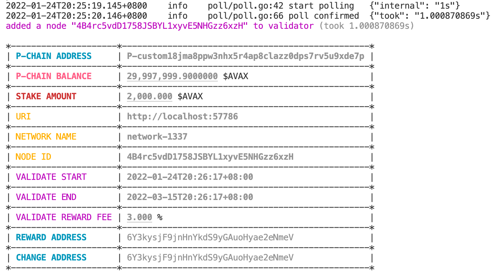
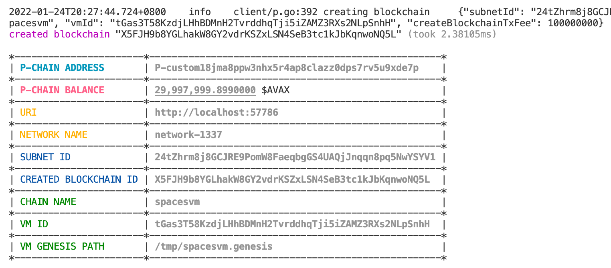

## `subnet-cli`

A command-line interface to manage Avalanche subnet.

```bash
# [OPTIONAL]
# build avalanchego for local testing
cd ${HOME}/go/src/github.com/ava-labs/avalanchego
rm -rf ./build
./scripts/build.sh

# [OPTIONAL]
# build test runner for local cluster setup
cd ${HOME}/go/src/github.com/ava-labs/subnet-cli/tests/runner
go build -o /tmp/subnet-cli.runner -v .
/tmp/subnet-cli.runner \
--avalanchego-path ${HOME}/go/src/github.com/ava-labs/avalanchego/build/avalanchego \
--whitelisted-subnets="24tZhrm8j8GCJRE9PomW8FaeqbgGS4UAQjJnqqn8pq5NwYSYV1" \
--output-path /tmp/subnet-cli.runner.yml

# [OPTIONAL]
# get cluster endpoints to send requests to
cat /tmp/subnet-cli.runner.yml
```

```yaml
...
networkId: 1337
uris:
- http://localhost:57574
...
```

Once you have the network endpoints (either from local test scripts or from existing cluster/network), run the following commands to install `subnet-cli` or visit [`subnet-cli/releases`](https://github.com/ava-labs/subnet-cli/releases):

```bash
cd ${HOME}/go/src/github.com/ava-labs/subnet-cli
go install -v .
```

Once you have installed `subnet-cli`, check the man page:

```bash
subnet-cli -h

Usage:
  subnet-cli [command]

Available Commands:
  add         Sub-commands for creating resources
  ...
```

### `subnet-cli create subnet`

```bash
subnet-cli create subnet \
--log-level=debug \
--private-key-path=.insecure.ewoq.key \
--public-uri=http://localhost:55749
```


```bash
# to create subnet only to the test network
subnet-cli create subnet \
--log-level=debug \
--private-key-path=[YOUR-PRIVATE-KEY-PATH] \
--public-uri=https://api.avax-test.network
```

### `subnet-cli add validator`

```bash
subnet-cli add validator \
--private-key-path=.insecure.ewoq.key \
--public-uri=http://localhost:55749 \
--node-id="NodeID-7Xhw2mDxuDS44j42TCB6U5579esbSt3Lg" \
--subnet-id="24tZhrm8j8GCJRE9PomW8FaeqbgGS4UAQjJnqqn8pq5NwYSYV1"
```




```bash
# for test network
subnet-cli add validator \
--private-key-path=[YOUR-PRIVATE-KEY-PATH] \
--public-uri=https://api.avax-test.network \
--node-id="[YOUR-NODE-ID]" \
--subnet-id="[YOUR-SUBNET-ID]"
```

### `subnet-cli create blockchain`

```bash
subnet-cli create blockchain \
--private-key-path=.insecure.ewoq.key \
--public-uri=http://localhost:55749 \
--subnet-id="24tZhrm8j8GCJRE9PomW8FaeqbgGS4UAQjJnqqn8pq5NwYSYV1" \
--vm-name=testvm \
--vm-id=tGas3T58KzdjLHhBDMnH2TvrddhqTji5iZAMZ3RXs2NLpSnhH \
--vm-genesis-path=/tmp/testvm.genesis
```




```bash
subnet-cli create blockchain \
--private-key-path=.insecure.ewoq.key \
--public-uri=https://api.avax-test.network \
--subnet-id="[YOUR-SUBNET-ID]" \
--vm-name="[YOUR-VM-NAME]" \
--vm-id="[YOUR-VM-ID]" \
--vm-genesis-path="[YOUR-VM-GENESIS-PATH]"
```

### `subnet-cli status blockchain`

To check the status of the blockchain `2o5THyMs4kVfC42yAiSt2SrjWNkxCLYZef1kewkqYPEiBPjKtn` from the private URI:

```bash
subnet-cli status blockchain \
--private-uri=http://localhost:55749 \
--blockchain-id="2o5THyMs4kVfC42yAiSt2SrjWNkxCLYZef1kewkqYPEiBPjKtn" \
--check-bootstrapped
```

See [`scripts/tests.e2e.sh`](scripts/tests.e2e.sh) and [`tests/e2e/e2e_test.go`](tests/e2e/e2e_test.go) for example tests.
