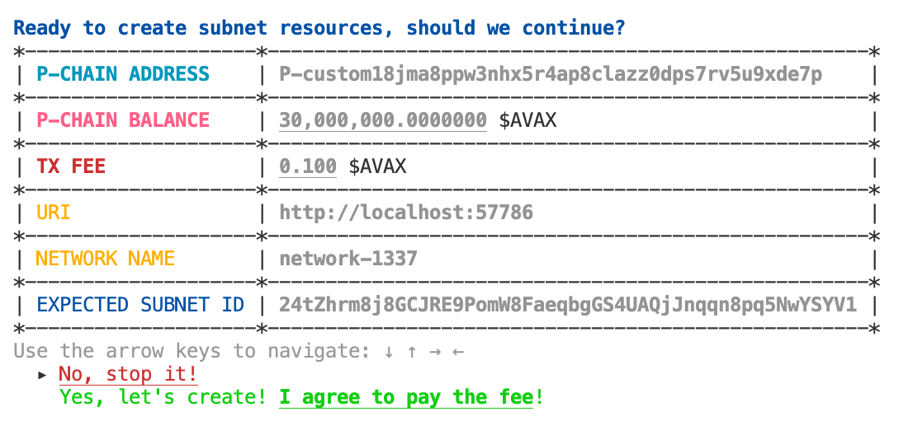
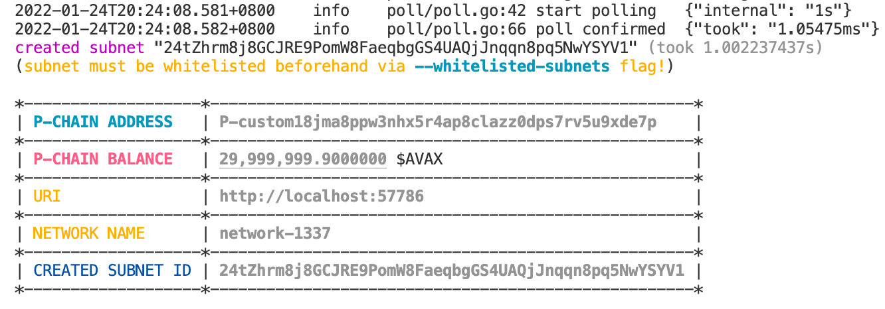

# subnet-cli

A command-line interface to manage [Avalanche Subnets](https://docs.avax.network/build/tutorials/platform/subnets).

## Install

```bash
git clone https://github.com/ava-labs/subnet-cli.git;
cd subnet-cli;
go install -v .;
```

Once you have installed `subnet-cli`, check the help page to confirm it is
working as expected (_make sure your $GOBIN is in your $PATH_):

```bash
subnet-cli CLI

Usage:
  subnet-cli [command]

Available Commands:
  add         Sub-commands for creating resources
  completion  Generate the autocompletion script for the specified shell
  create      Sub-commands for creating resources
  help        Help about any command
  status      status commands

Flags:
      --enable-prompt              'true' to enable prompt mode (default true)
  -h, --help                       help for subnet-cli
      --log-level string           log level (default "info")
      --poll-interval duration     interval to poll tx/blockchain status (default 1s)
      --request-timeout duration   request timeout (default 2m0s)

Use "subnet-cli [command] --help" for more information about a command.
```

## Usage

The following commands will walk you through creating a subnet on Fuji.

### `subnet-cli create VMID`

This command is used to generate a valid VMID based on some string to uniquely
identify a VM. This should stay the same for all versions of the VM, so it
should be based on a word rather than the hash of some code.

```bash
subnet-cli create VMID <identifier> [--hash]
```

### `subnet-cli create key`

```bash
subnet-cli create key
```

`subnet-cli` will assume you have funds on this key (or `--private-key-path`) on the P-Chain for the
rest of this walkthrough.

The easiest way to do this (**for testing only**) is:

1) Import your private key (`.subnet-cli.pk`) into the [web wallet](https://wallet.avax.network)
2) Request funds from the [faucet](https://faucet.avax-test.network)
3) Move the test funds (sent on either the X or C-Chain) to the P-Chain [(Tutorial)](https://docs.avax.network/build/tutorials/platform/transfer-avax-between-x-chain-and-p-chain/)

After following these 3 steps, your test key should now have a balance on the
P-Chain.

### `subnet-cli create subnet`

```bash
subnet-cli create subnet
```

To create a subnet in the local network:

```bash
subnet-cli create subnet \
--private-key-path=.insecure.ewoq.key \
--public-uri=http://localhost:55749
```




### `subnet-cli add validator`

```bash
subnet-cli add validator \
--node-id="[YOUR-NODE-ID]" \
--subnet-id="[YOUR-SUBNET-ID]"
```

To add a validator with the local network:

```bash
subnet-cli add validator \
--private-key-path=.insecure.ewoq.key \
--public-uri=http://localhost:55749 \
--node-id="NodeID-7Xhw2mDxuDS44j42TCB6U5579esbSt3Lg" \
--subnet-id="24tZhrm8j8GCJRE9PomW8FaeqbgGS4UAQjJnqqn8pq5NwYSYV1"
```


### `subnet-cli create blockchain`

```bash
subnet-cli create blockchain \
--subnet-id="[YOUR-SUBNET-ID]" \
--chain-name="[YOUR-CHAIN-NAME]" \
--vm-id="[YOUR-VM-ID]" \
--vm-genesis-path="[YOUR-VM-GENESIS-PATH]"
```

To create a blockchain with the local cluster:

```bash
subnet-cli create blockchain \
--private-key-path=.insecure.ewoq.key \
--public-uri=http://localhost:55749 \
--subnet-id="24tZhrm8j8GCJRE9PomW8FaeqbgGS4UAQjJnqqn8pq5NwYSYV1" \
--chain-name=test \
--vm-id=tGas3T58KzdjLHhBDMnH2TvrddhqTji5iZAMZ3RXs2NLpSnhH \
--vm-genesis-path=/tmp/testvm.genesis
```


### `subnet-cli status blockchain`

To check the status of the blockchain `2o5THyMs4kVfC42yAiSt2SrjWNkxCLYZef1kewkqYPEiBPjKtn` from the private URI:

```bash
subnet-cli status blockchain \
--private-uri=http://localhost:55749 \
--blockchain-id="2o5THyMs4kVfC42yAiSt2SrjWNkxCLYZef1kewkqYPEiBPjKtn" \
--check-bootstrapped
```

See [`scripts/tests.e2e.sh`](scripts/tests.e2e.sh) and [`tests/e2e/e2e_test.go`](tests/e2e/e2e_test.go) for example tests.

## Running with local network

```bash
# [OPTIONAL]
# build avalanchego for local testing
cd ${HOME}/go/src/github.com/ava-labs/avalanchego
rm -rf ./build
./scripts/build.sh

# [OPTIONAL]
# build test runner for local cluster setup
cd ${HOME}/go/src/github.com/ava-labs/subnet-cli/tests/runner
go build -o /tmp/subnet-cli.runner -v .
/tmp/subnet-cli.runner \
--avalanchego-path ${HOME}/go/src/github.com/ava-labs/avalanchego/build/avalanchego \
--whitelisted-subnets="24tZhrm8j8GCJRE9PomW8FaeqbgGS4UAQjJnqqn8pq5NwYSYV1" \
--output-path /tmp/subnet-cli.runner.yml

# [OPTIONAL]
# get cluster endpoints to send requests to
cat /tmp/subnet-cli.runner.yml
```

```yaml
uris:
- http://localhost:57574
...
```
